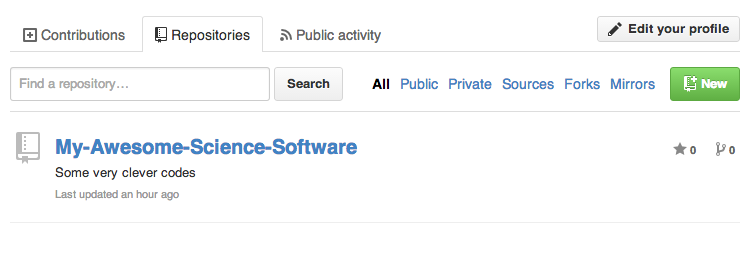
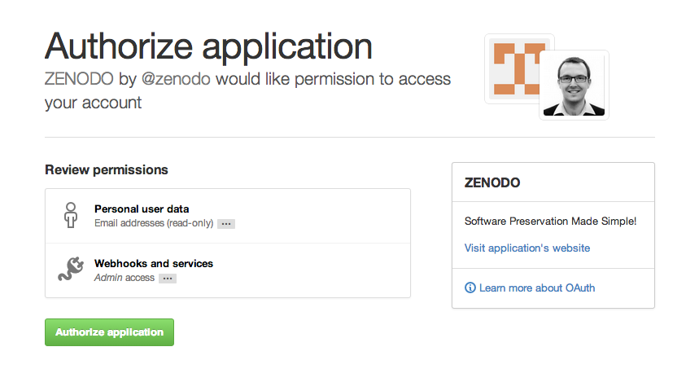
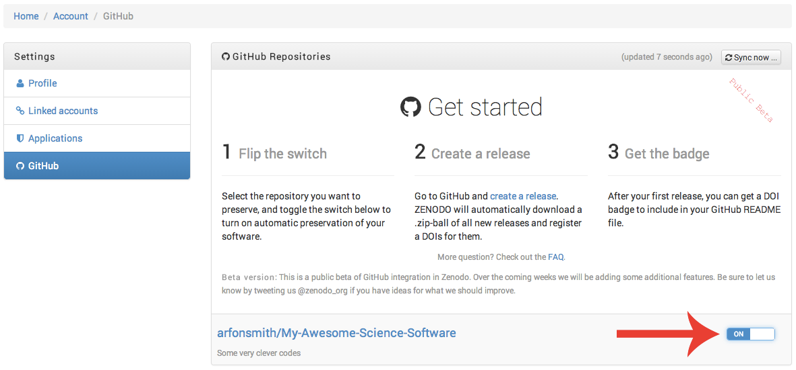
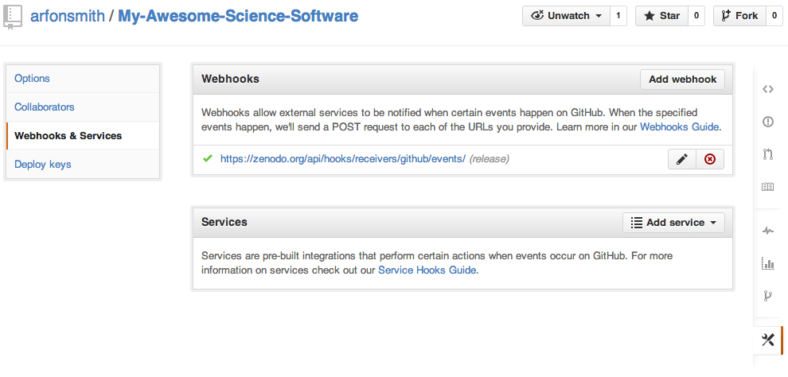
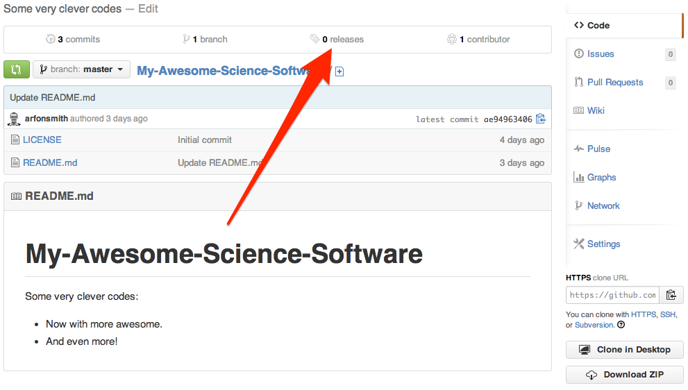
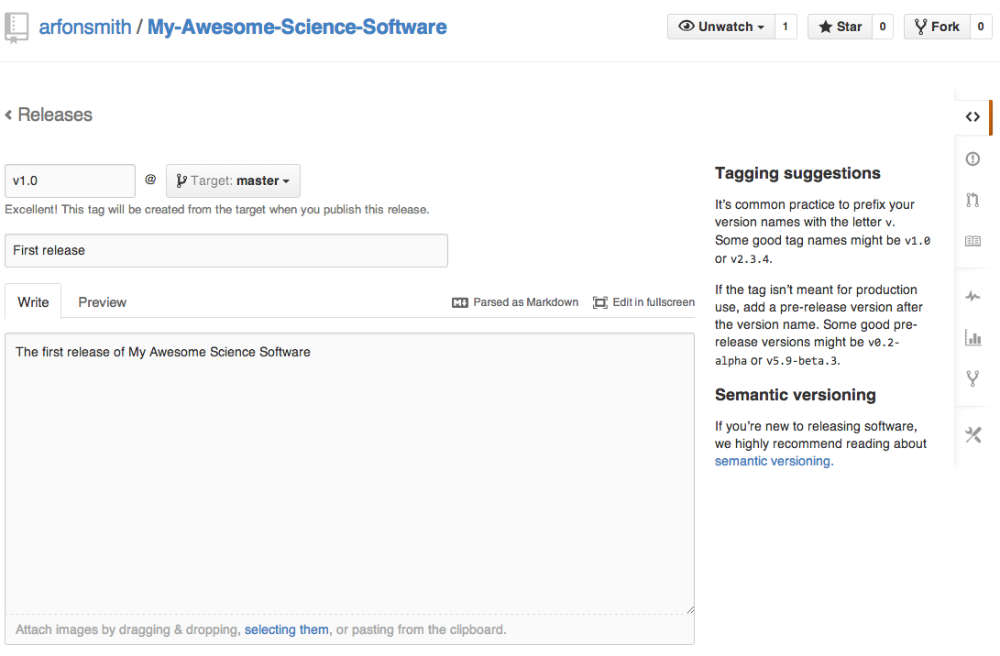
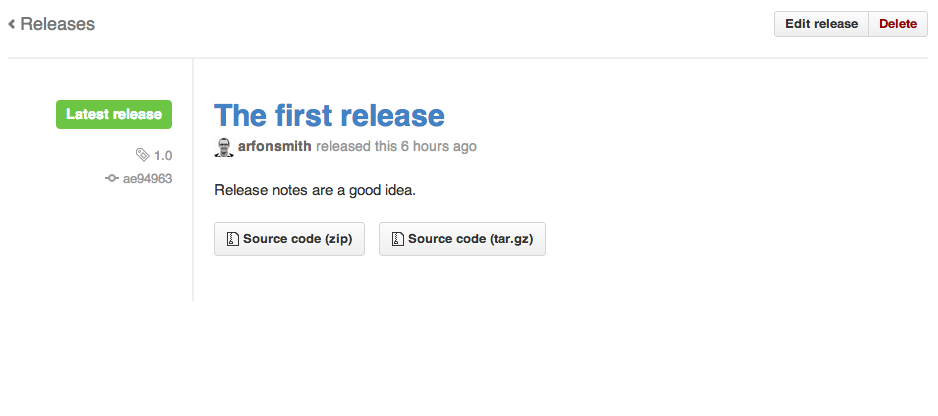
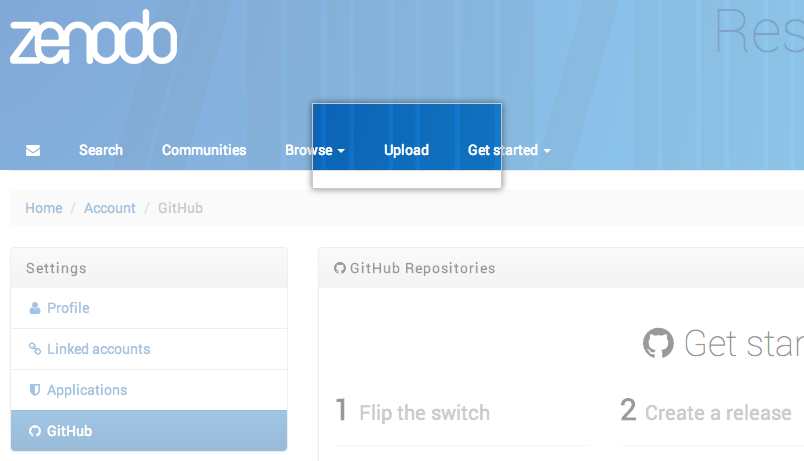
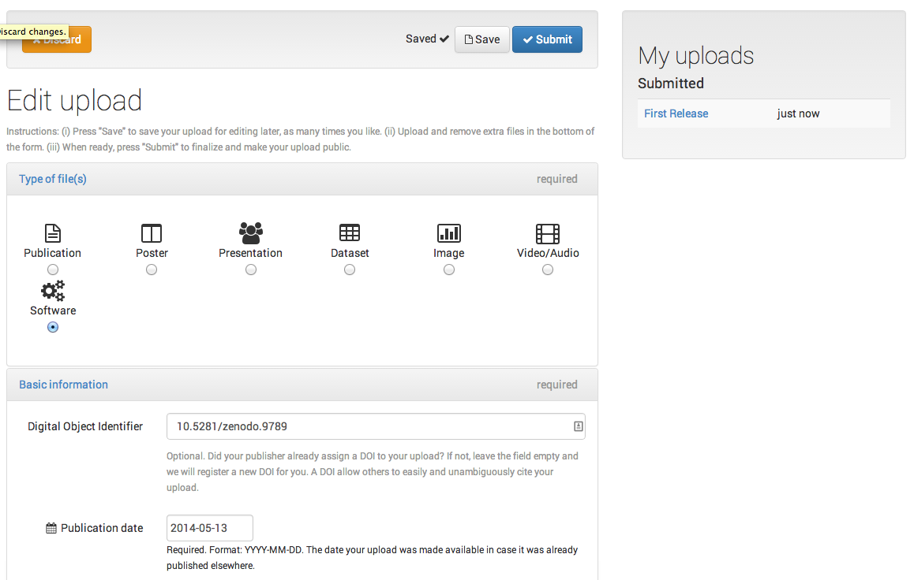

[Digital Object Identifiers](http://en.wikipedia.org/wiki/Digital_object_identifier) (DOI) are the backbone of the academic reference and metrics system. If you're a researcher writing software then this guide will show you how to make your work citable in the academic referencing system.

In this tutorial we're going to learn how to archive one of your GitHub repositories and assign it a DOI using the data archiving tool [Zenodo](https://zenodo.org/).

> **Tip:** Note, this tutorial is aimed at researchers who want to cite GitHub repositories in the academic literature. Most people don't need to do this but if you do then read on...

_Should explain what Zenodo is here?_

#### Install & Code Free Zone

Provided you've already got a GitHub repository set up that you want to archive then this tutorial can be completed without installing any special software. If you haven't got your project on GitHub yet then check out this guide that explains how to [upload your work](https://guides.github.com/introduction/desktop/) to GitHub.

## Choosing Your Repository

Repositories are the basic unit of GitHub. We first need to select the repository we want to archive in Zenodo. Head over to your profile and click the **Repositories** tab.

> **Important!** Make sure you tell people how they can reuse your work by including a license in your repository. If you don't know which license is right for you then take a look at [choosealicense.com](http://choosealicense.com/)

## Login to Zenodo

Next, head over to [Zenodo](http://zenodo.org) and click the **Sign In** button at the top right of the page which gives you an option to login with your GitHub account :zap:.

Zenodo will redirect you back to GitHub to ask for your permission to share your email address and the ability to configure [webhooks](https://developer.github.com/webhooks/) on your repositories. Go ahead and click **Authorize application** to give Zenodo the permissions it needs.

> **Pro-tip** This integration with Zenodo makes use of the GitHub [API webhooks](https://developer.github.com/webhooks/) which is a broadcast API for your GitHub repositories.

### Pick the repository you want to archive

At this point, you've just authorized Zenodo to configure the webhooks for your repositories to allow for archiving and DOI-issuing. To enable this functionality we need to click the **On** toggle button next to our repository (in this case **My-Awesome-Science-Software**).

That's all we need to do for now here. Back to GitHub!

## Check Repository Settings

By switching archiving on in Zenodo, we have set up a new webhook on our repository. Let's got and take a look at that now.

Click the settings icon  and then click 'Webhooks &amp; Services' in the left-hand menu. If all has gone to plan then you should see something like in the screengrab below listing a new webhook configured to post to Zenodo.org.

## Create a New Release

By default, Zenodo takes an archive of your GitHub repository each time you create a new [Release](https://help.github.com/articles/creating-releases) so let's go ahead and create one to test things out.

Head back to the main repository view and click on the **releases** header item.

Unless you've created releases for this repository before then you will be asked to **Create a new release**. Go ahead and click this button and fill in the new release form.

If this is the first release of your code then you should probably give it a version number of `1.0`. Fill in any release notes and click the **Publish release** button.

Provided everything has gone swimmingly thus far then the creation of this new release should have triggered Zenodo into archiving our repository. Let's head back over to Zenodo to see what's waiting for us.

## Minting a DOI

Before Zenodo can issue a DOI for our repository they need a little bit more information about the GitHub repo that we've just archived.

Click the **Upload** tab from your Zenodo profile and you should see a new upload in the right-hand panel.

Next we need to fill in the form to complete this submission. Once you're happy with the description of your software click the **Submit** button at the bottom and voil&agrave;, you've just made  yourself a shiny new DOI for your GitHub repo!

## Finishing Up
