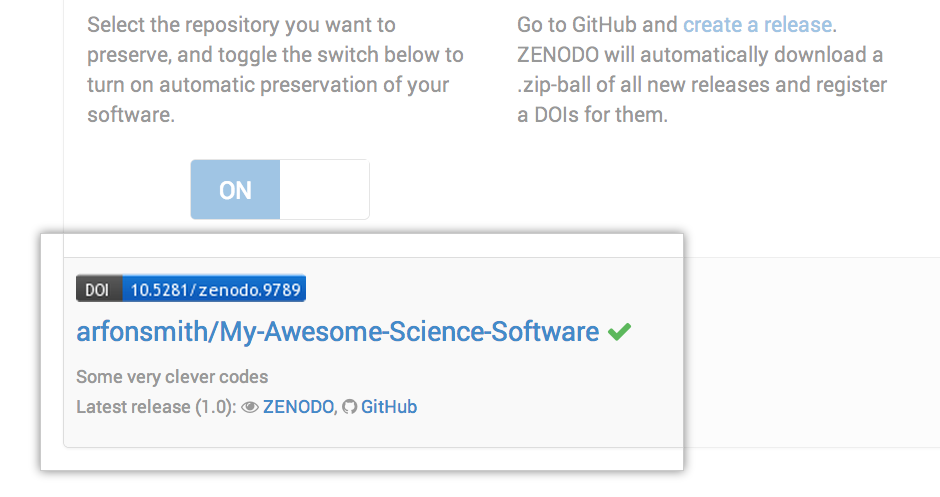

[Digital Object Identifiers](http://en.wikipedia.org/wiki/Digital_object_identifier) (DOI) are the backbone of the academic reference and metrics system. If you're a researcher writing software, this guide will show you how to make the work you share on GitHub citable by archiving one of your GitHub repositories and assigning a DOI with the data archiving tool [Zenodo](https://zenodo.org/about).

> **ProTip:** This tutorial is aimed at researchers who want to cite GitHub repositories in academic literature. Provided you've already set up a GitHub repository, this tutorial can be completed without installing any special software. If you haven't yet created a project on GitHub, start first by [uploading your work](https://guides.github.com/introduction/desktop/) to a repository.

## Choose your repository

Repositories are the most basic element of GitHub. They're easiest to imagine as your project's folder. The first step in creating a DOI is to select the repository you want to archive in Zenodo. To do so, head over to your profile and click the **Repositories** tab.

> **Important!** Make sure you tell people how they can reuse your work by including a license in your repository. If you don't know which license is right for you, then take a look at [choosealicense.com](http://choosealicense.com/).

## Login to Zenodo

Next, head over to [Zenodo](http://zenodo.org) and click the **Sign In** button at the top right of the page, which gives you an option to login with your GitHub account.

Zenodo will redirect you back to GitHub to ask for your permission to share your email address and the ability to configure [webhooks](https://developer.github.com/webhooks/) on your repositories. Go ahead and click **Authorize application** to give Zenodo the permissions it needs.

### Pick the repository you want to archive

At this point, you've authorized Zenodo to configure the repository webhooks needed to allow for archiving and DOI-issuing. To enable this functionality, simply click the **On** toggle button next to your repository (in this case **My-Awesome-Science-Software**).

## Check repository settings

By enabling archiving in Zenodo, you have set up a new webhook on your repository. Click the settings icon  in your repository, and then click 'Webhooks &amp; Services' in the left-hand menu. You should see something like the image below, which shows a new webhook configured to send messages to Zenodo.

## Create a new release

By default, Zenodo takes an archive of your GitHub repository each time you create a new [Release](https://help.github.com/articles/about-releases). To test this out, head back to the main repository view and click on the **releases** header item.

Unless you've created releases for this repository before, you will be asked to **Create a new release**. Go ahead and click this button and fill in the new release form.

If this is the first release of your code then you should give it a version number of `1.0`. Fill in any release notes and click the **Publish release** button.

## Checking everything has worked

Creating a new release will trigger Zenodo into archiving your repository. You can confirm that this process took place by click the **Upload** tab in your Zenodo profile. You should see a new upload in the right-hand panel.

## Minting a DOI

Before Zenodo can issue a DOI for your repository, you will need to provide some information about the GitHub repo that you've just archived.

Once you're happy with the description of your software, click the **Submit** button at the bottom of the Zenodo form, and voil&agrave;, you've just made a shiny new DOI for your GitHub repo!

## Finishing up

Back on your <a href="https://zenodo.org/account/settings/github" data-proofer-ignore">Zenodo GitHub page</a> you should now see your repository listed with a shiny new badge showing your new DOI!

> **ProTip:** If you really want to show off, then right click on the gray and blue DOI image and copy the URL and place it in your README on your GitHub repo.

