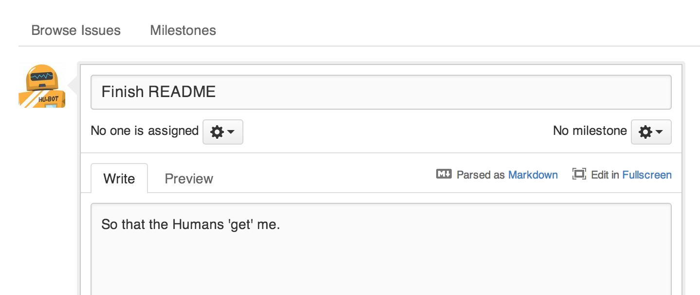
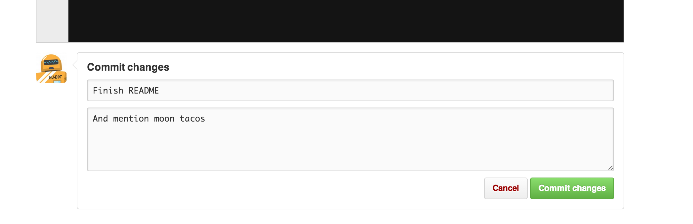

The **Hello World** project is a time-honored tradition in computer programming. It is a simple exercise that gets you started when learning something new. Let's get started with GitHub!

GitHub is a platform for hosting and collaborating on projects. You don't have to worry about losing data on your hard drive or managing a project across multiple computers — sync from anywhere. Most importantly, GitHub is a collaborative and asynchronous workflow for building software better, together.

This guide walks you through the GitHub Essentials: **Repositories**, **Branches**, **Commits**, **Issues** and **Pull Requests**.

With these skills, you'll go far. And with this `hello-world` repository you'll have a place to store ideas (aka future repositories, like [jlord/hello-world](https://github.com/jlord/hello-world)), resources or other general notes, even discuss things with others (like [holman/feedback](https://github.com/holman/feedback)).

#### Install & Code Free Zone

We're going to complete the tasks in this tutorial using GitHub.com, so you don't have to know the command line or even install Git (which is the change-tracking software GitHub is built on). You don't even need to know how to code. You will, however, need a GitHub account, so sign up if you don't have one!

> **Tip:** Open this guide in a separate browser window (or tab) so you can see it while you complete the steps in the tutorial.

## Create a Repository

A **repository** is the basic unit of GitHub, most commonly a single project. Repositories can contain folders and files, including images -- anything your project needs. Because we recommend including a README, or a file describing the project, in every repository, GitHub makes it easy to add one at the same time you create your new repository. _It also offers other common options such as a license file, but we can skip that for now._

### To create a new repository

1. Click the  icon next to your username, top-right.
2. Name your repository `hello-world`.
3. Write a short description.
4. Select **Initialize this repository with a README**.

Click **Create repository**. Boom, repository! :boom:

## Open an Issue

An **Issue** is a note on a repository about something that needs attention. It could be a bug, a feature request, a question or lots of other things. On GitHub you can label, search and assign Issues, making managing an active project easier.

You've got a repository now, but it's pretty bare. It could use a README with more information in it so that people know what is going on. Open an Issue!

### Open an Issue for README edits

1. Click the  **Issues** tab from the sidebar.
2. Click **New Issue**.
3. Give your Issue a title and description.

Click **Submit new Issue** when you're done. Now this issue has a permanent home (URL) that you can reference even after it is closed.

Next, work towards editing your README and closing this issue.

## Create a Branch

**Branching** is the way to work on different parts of a repository at one time.

When you create a repository, by default it has one branch with the name `master`. You could keep working on this branch and have only one, that's fine. But if you have another feature or idea you want to work on, you can create another branch, starting from `master`, so that you can leave `master` in its working state.

When you create a branch, you're making a copy of the original branch as it was at that point in time (like a photo snapshot). If the original branch changes while you're working on your new branch, no worries, you can always pull in those updates.

You may have, at some point in your life, saved different versions of a file like, "story.txt", "story-joe-edit.txt", "story-sue-edit.txt". Branches accomplish the same goals but are easier to manage on GitHub repositories.

At GitHub, our developers, writers, and designers use branches for keeping bug fixes and feature work separate from our `master` (production) branch. When a feature or fix is ready, the branch is merged into `master`.

### To create a new branch

1. Go to your new repository `hello-world`.
2. Click the drop down at the top of the file list that says **branch: master**.
3. Type a branch name, `readme-edits`, into the new branch text box.
4. Select the blue **Create branch** box or hit "Enter" on your keyboard.

Now you have two branches, `master` and `readme-edits`. They look exactly the same, but not for long! Next we'll add our changes to the new branch.

## Make a commit

On GitHub, saved changes are called **commits**. Commits are pretty glorious, because a bunch of them together read like the history of your project.

Each commit has an associated **commit message**, which is a description explaining why a particular change was made. Thanks to these messages, you and others can read through commits and understand what you've done and why.

You should still be on the code view for your `readme-edits` branch, now make some changes!

#### To commit changes

1. Click the README file.
2. Click **Edit**.
3. In the editor, write some text, tell a bit about yourself.
4. Write a commit message that describes your changes.

Click **Commit changes**. Now these changes have been made to the README file on your `readme-edits` branch and now this branch contains different content and commits than `master` (as it should!).

## Open a Pull Request

Pull Requests are the heart of collaboration on GitHub. When you make a **pull request**, you're proposing your changes and requesting that someone pull in your contribution - aka merge them into their branch. GitHub's Pull Request feature allows you to compare the content on two branches. The changes, additions and subtractions, are show in green and red and called **diffs** (differences).

As soon as you make a change, you can open a Pull Request. People use Pull Requests to start a discussion about commits (code review) even before the code is finished. This way you can get feedback as you go or help when you're stuck.

By using GitHub's [@mention system](https://github.com/blog/821-mention-somebody-they-re-notified) in your Pull Request message, you can ask for feedback from specific people or teams, whether they're down the hall or 10 time zones away.

You can even open, as we're doing here, a Pull Request in your own repository and merge it yourself. It's a great way to learn to process before working on larger projects.

#### Create a Pull Request for changes to the README

_Click on the image for a larger version_

| Step | Screenshot |
| --- | --- |
| Click the  Pull Request icon on the sidebar, then from the Pull Request page, click the green **Create pull request** button. |  |
| Select the branch you made, `readme-edits`, to compare with `master` (the original). |  |
| Look over your changes in the diffs on the Compare page, make sure they're what you want to submit. |  |
| When you're satisfied that these are the changes you want to submit, click the big green **Create Pull Request** button. |  |
| Give your pull request a title and since it relates directly to an open issue, include "fixes #" and the issue number in the title. Write a brief description of your changes. | 

When you're done with your message, click **Send Pull Request**!

---

> **Tip**: You can use [emoji](https://github.com/blog/1289-emoji-autocomplete) and [drag and drop images and gifs](https://github.com/blog/1347-issue-attachments) onto comments and Pull Requests.

## Merge your Pull Request

It's time to bring your changes together -- merge your `readme-edits` branch into the `master` branch.

1. Click the green button to merge the changes into `master`.
2. Click **Confirm merge**.
2. Go ahead and delete the branch, since its changes have been incorporated, with the **Delete branch** button in the purple box.

If you revisit the issue you opened, it's now closed! Because you included "fixes #1" in your Pull Request title, GitHub took care of closing that issue when the Pull Request was merged!

### Celebrate!

You've learned to make a pull request on GitHub! :tada: :octocat: :zap:

For your humblebrag, here are the things you accomplished in this tutorial: created a repository, branch, issue, and pull request, then merged a pull request! Show off your new [contribution squares](https://github.com/blog/1360-introducing-contributions)!

If you want to learn more about the power of pull requests, we recommend reading the [GitHub Flow Guide](http://guides.github.com/overviews/flow/). You might also visit [GitHub Explore](http://github.com/explore) and get involved in an Open Source project :octocat:

---

> **Tip**: Check out our other [Guides](http://guides.github.com) and [YouTube Channel](http://youtube.com/githubguides) for more GitHub how-tos.
