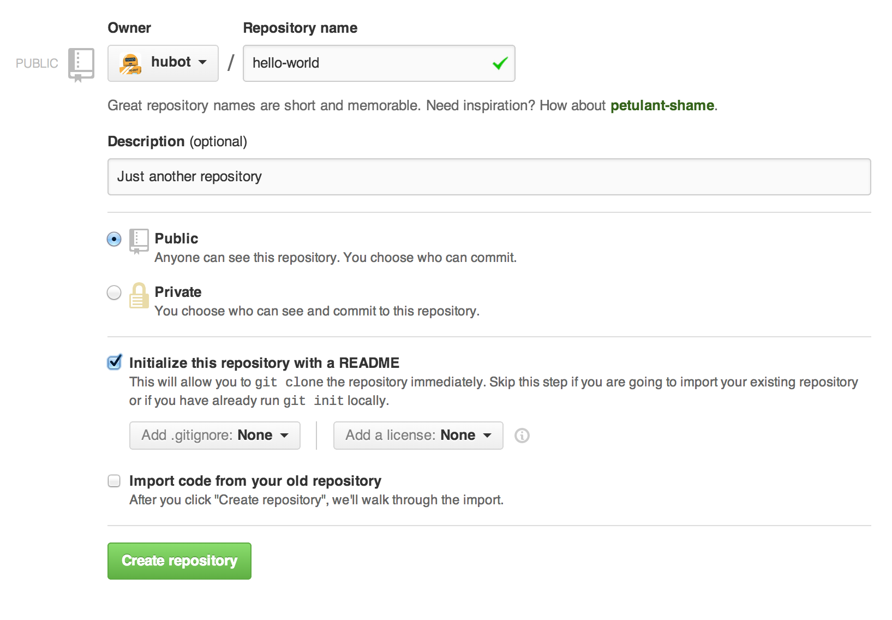
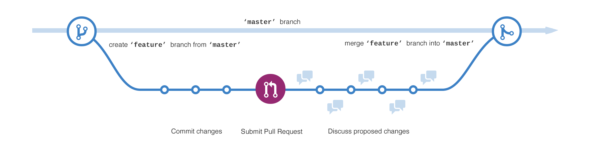
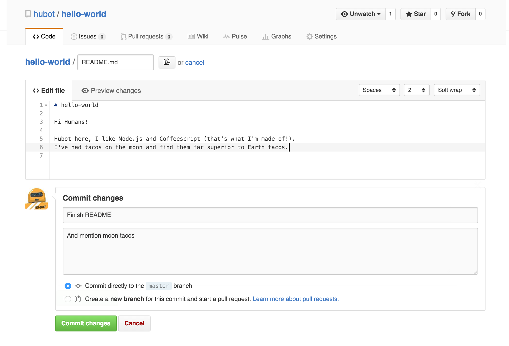
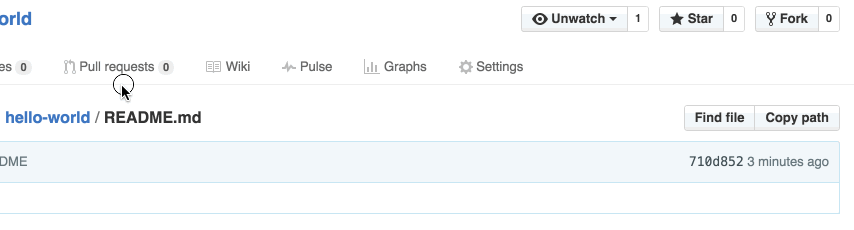
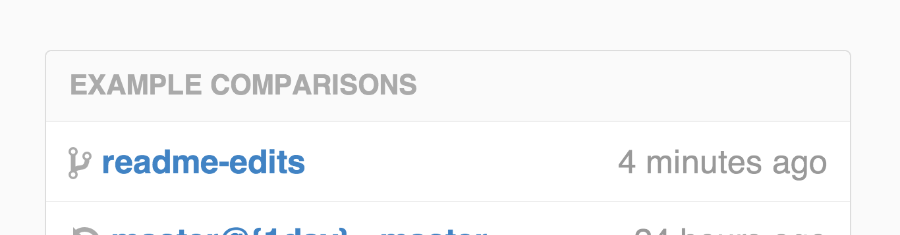
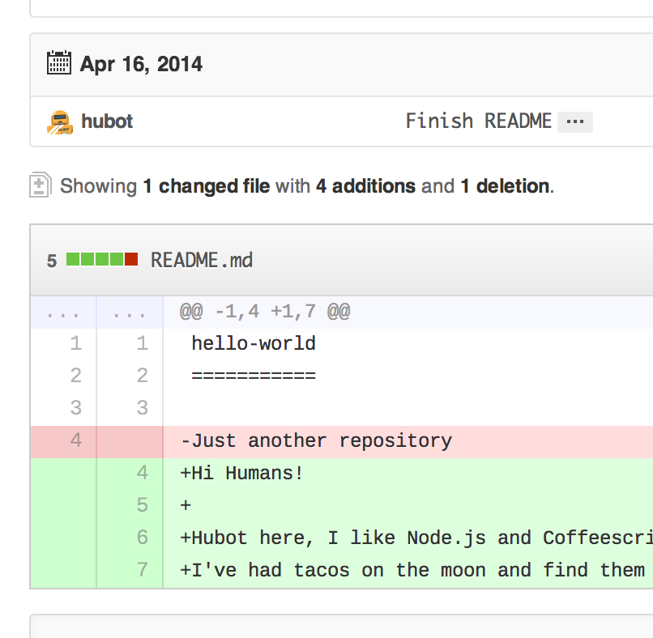
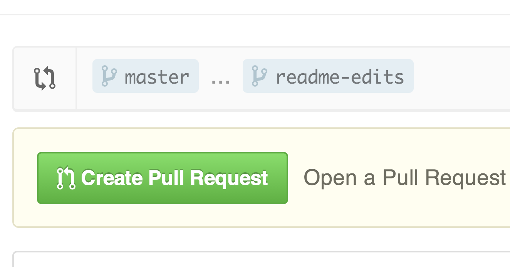
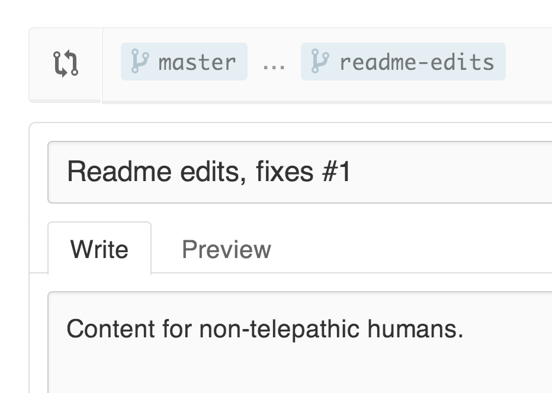
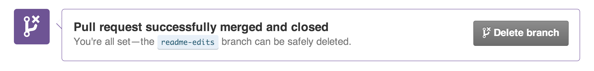

**Hello World** projects are a time-honored [tradition](http://en.wikipedia.org/wiki/%22Hello,_World!%22_program) in computer programming. Everyone starts somewhere, and Hello World is a great exercise that helps you learn something new in programming like GitHub.

**What you will learn:**

* How to create and use a repository
* How to start and manage a new branch
* How to make changes to a file and push them to GitHub as commits
* How to open and merge a Pull Request

## What is GitHub?

GitHub is a platform for version control, code hosting, project collaboration (namely code review). When you put a project on GitHub, you don't have to worry about losing data on your hard drive or updating a project across multiple computers. GitHub allows you and anyone you're working with on a project to download and sync a copy of your project from anywhere.

This tutorial guides you through some GitHub Essentials: **Repositories**, **Branches**, **Commits**, and **Pull Requests**. By following the tutorial you will create your own Hello World repository and become the maintainer of an open source project. You will also learn GitHub's pull requests workflow, which is a popular way of contributing code and code review to private and open source projects.

#### No coding needed

We're going to complete the tasks in this tutorial using GitHub.com, so you need a [GitHub.com account](http://github.com) and connection to the Internet.

You don't need to know how to code, use the command line, or install Git (the version control software GitHub is built on).

> **Tip:** Open this guide in a separate browser window (or tab) so you can see it while you complete the steps in the tutorial.

## Step 1. Create a Repository

A **repository** is the basic unit of GitHub and most commonly used to organize a single project. You might think of it as a project bucket. Repositories can contain folders and files, images, videos, spreadsheets, and data sets -- anything your project needs. We recommend including a README, or a file describing the project. GitHub makes it easy to add one at the same time you create your new repository. _It also offers other common options such as a license file._

Your `hello-world` repository can be a place where you store ideas, resources, or even share and discuss things with others.

### To create a new repository

1. Click the  icon next to your username, top-right and then click **New repository**.
2. Name your repository `hello-world`.
3. Write a short description.
4. Select **Initialize this repository with a README**.

Click **Create repository**. :boom:

## Step 2. Create a Branch

**Branching** allows you and other contributors to work on different parts of a repository (project) without writing over the main project.

By default your repository has one branch named `master`. We use branches to experiment and make edits before committing them to master.

When you create a branch, you're making a copy of the original `master` branch as it was at that point in time (like a photo snapshot). If the `master` branch changes while you're working on your new branch, no worries, you can always pull in those updates.

Here's a diagram that depicts the `master` branch, `feature` branch, and the journey `feature` takes before it is merged into `master`.

Have you ever saved different versions of a file like, "story.txt", "story-joe-edit.txt", "story-sue-edit.txt"? Branches accomplish similar goals on GitHub repositories.

At GitHub, our developers, writers, and designers use branches for keeping bug fixes and feature work separate from our `master` (production) branch. When a bug fix or feature is ready, the branch is merged into `master`.

### To create a new branch

1. Go to your new repository `hello-world`.
2. Click the drop down at the top of the file list that says **branch: master**.
3. Type a branch name, `readme-edits`, into the new branch text box.
4. Select the blue **Create branch** box or hit "Enter" on your keyboard.

Now you have two branches, `master` and `readme-edits`. They look exactly the same, but not for long! Next we'll add our changes to the new branch.

## Step 3. Make and commit changes

Bravo! Now, you're on the code view for your `readme-edits` branch, which is a copy of `master`. Let's make some edits.

On GitHub, saved changes are called **commits**. Each commit has an associated **commit message**, which is a description explaining why a particular change was made. Commit messages capture the history of your changes, so other contributors can understand what you’ve done and why.

#### Make and commit changes

1. Click the `README.md` file.
2. Click the pencil icon in the upper right corner of the file view to edit.
3. In the editor, add some text, write a bit about yourself.
4. Write a commit message that describes your changes.

Click **Commit changes** button. Now these changes have been made to the README file on your `readme-edits` branch and now this branch contains different content and commits than `master` (as it should!).

## Step 4. Open a Pull Request

Nice edits! To move your changes to `master` (the main copy) the next step is to open a Pull Request.

Pull Requests are the heart of collaboration on GitHub. When you open a **pull request**, you're proposing your changes and requesting that someone review and pull in your contribution and merge them into their branch. GitHub Pull Requests allow you to compare the content from both branches. The changes, additions and subtractions, are shown in green and red and called **diffs** (differences).

As soon as you make a change to a file, you can open a Pull Request and start a discussion about commits (code review) even before the code is finished. This way you can get feedback as you go or help when you're stuck.

By using GitHub's [@mention system](https://help.github.com/articles/about-writing-and-formatting-on-github/#text-formatting-toolbar) in your Pull Request message, you can ask for feedback from specific people or teams, whether they're down the hall or 10 time zones away.

You can even open, as we're doing here, a Pull Request in your own repository and merge it yourself. It's a great way to learn the process before working on larger projects.

#### Open a Pull Request for changes to the README

_Click on the image for a larger version_

| Step | Screenshot |
| --- | --- |
| Click the  **Pull Request** tab, then from the Pull Request page, click the green **New pull request** button. |  |
| Select the branch you made, `readme-edits`, to compare with `master` (the original). |  |
| Look over your changes in the diffs on the Compare page, make sure they're what you want to submit. |  |
| When you're satisfied that these are the changes you want to submit, click the big green **Create Pull Request** button. |  |
| Give your pull request a title and write a brief description of your changes. | 

When you're done with your message, click **Create pull request**!

---

> **Tip**: You can use [emoji](https://github.com/blog/1289-emoji-autocomplete) and [drag and drop images and gifs](https://help.github.com/articles/file-attachments-on-issues-and-pull-requests/) onto comments and Pull Requests.

## Step 5. Merge your Pull Request

In this final step, it's time to bring your changes together -- merge your `readme-edits` branch into the `master` branch.

1. Click the green **Merge pull request** button to merge the changes into `master`.
2. Click **Confirm merge** button.
2. Go ahead and delete the branch, since its changes have been incorporated, with the **Delete branch** button in the purple box.

### Celebrate!

By completing this tutorial, you've learned to create a project and make a pull request on GitHub! :tada: :octocat: :zap:

For your humblebrag, here are the things you accomplished in this tutorial:

* Created and a repository
* Started and managed a new branch
* Changed a file and commits to GitHub
* Opened and merged a Pull Request

Take a look at your GitHub profile and you'll see your new [contribution squares](https://help.github.com/articles/viewing-contributions)!

If you want to learn more about the power of pull requests, we recommend reading the [GitHub Flow Guide](http://guides.github.com/overviews/flow/). You might also visit [GitHub Explore](http://github.com/explore) and get involved in an Open Source project :octocat:

---

> **Tip**: Check out our other [Guides](http://guides.github.com) and [YouTube Channel](http://youtube.com/githubguides) for more GitHub how-tos.
