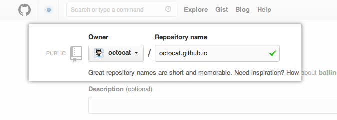
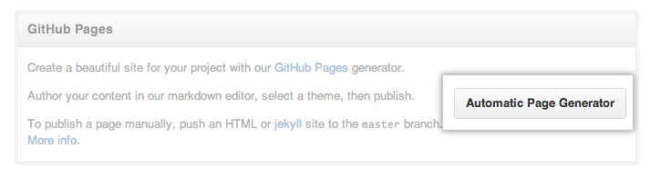
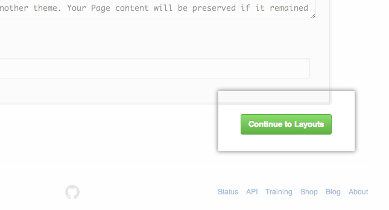
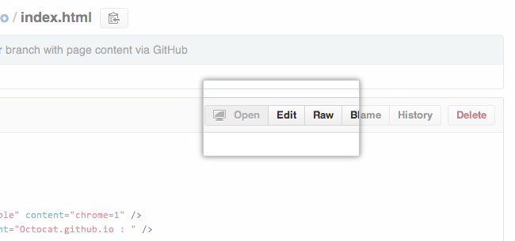
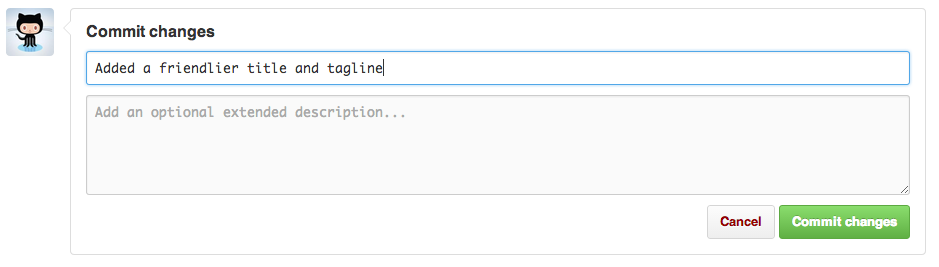

GitHub Pages are public webpages freely hosted and easily published through GitHub. The quickest way to get up and running is by using the Automatic Page Generator to create some starter HTML and CSS for us. We can then modify our GitHub Pages' content and style remotely via the web or locally on our computer.

## Create Your Website

Once we're <a href="https://github.com/login" target="_blank">signed in</a> we will create a new repository to get started.

On the new repository screen, we need to give this repository a special name to generate our website.

Our website's HTML and CSS will all live in a repository named `username.github.io` (where "username" is our actual user name, of course). To get an initial set of HTML and CSS, we have to open the settings tab and enable the Automatic Page Generator

If we scroll down on the settings page, we should see the **Automatic Page Generator** button near the bottom. By clicking this button, we will begin the process of generating our content automatically.

Once we've clicked the button, we're directed to the first step of the generation: The Content. We can keep this default content for now and make changes to it later. Let's go ahead and click **Continue to Layouts** at the bottom of the page to continue.

Now we pick our theme. This part requires a bit more thought because it's easier to choose a theme now than to update our theme later. When we've looked at some of the options at the top of the page and found one that we love, click **Publish** to finish.

Once we click **Publish**, GitHub does all the work to direct visitors to `username.github.io` to view your new website. This can take up to 10 minutes. After some time has passed, we can open a new tab in our browser to go to our site!

## Making Changes

One of the first things we can do is remove the default title of our index page, and add a friendlier message to it. Since this is a very quick change -- and our first one -- we're going to make it on the default branch: `gh-pages`.

If we click on `index.html` to navigate into that file, we can make edits to it by selecting the edit button.

Let's find in this file where it says `username.github.io` and change this to a more friendly name. For the Octocat, I'm going to change it to "Welcome to the Octocat's Homepage". Feel free to do the same, except for your own username! Under this title, we should add a message about the purpose of the page and describe what we want people to do while they're here.

After we're done making this small change, scroll to the bottom of the page to make our first commit. We have two places to write about this change: a subject and an extended description. The extended description is optional, so let's leave a descriptive message in the subject.

When we're done, we can click `Commit Changes` and our change should go live in just a few seconds!

## Next Steps

Just because we've made some changes into our project doesn't mean we should stop! Check out these other guides so we can contribute to other projects or get someone to help us out with our project:

- [GitHub Flow] [1]
- [Contributing to Open Source] [2]
- [Open Sourcing Your Work] [3]

[1]: /overviews/flow
[2]: /overviews/os-contributing/
[3]: /overviews/create-os/
