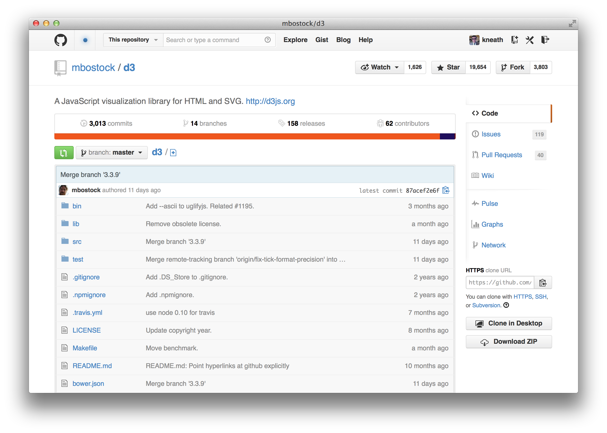
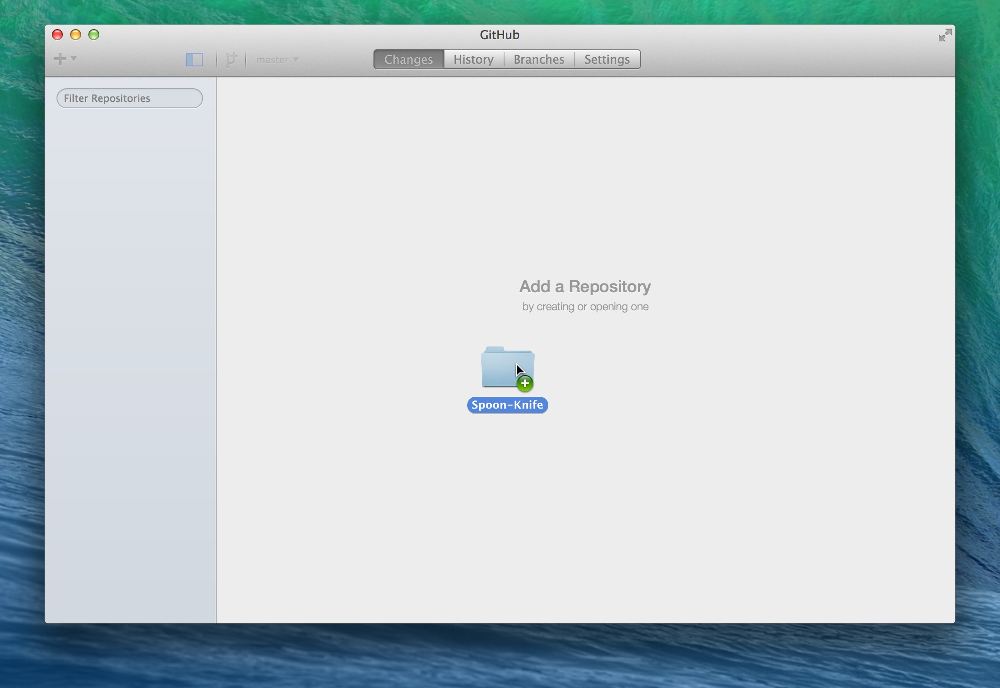
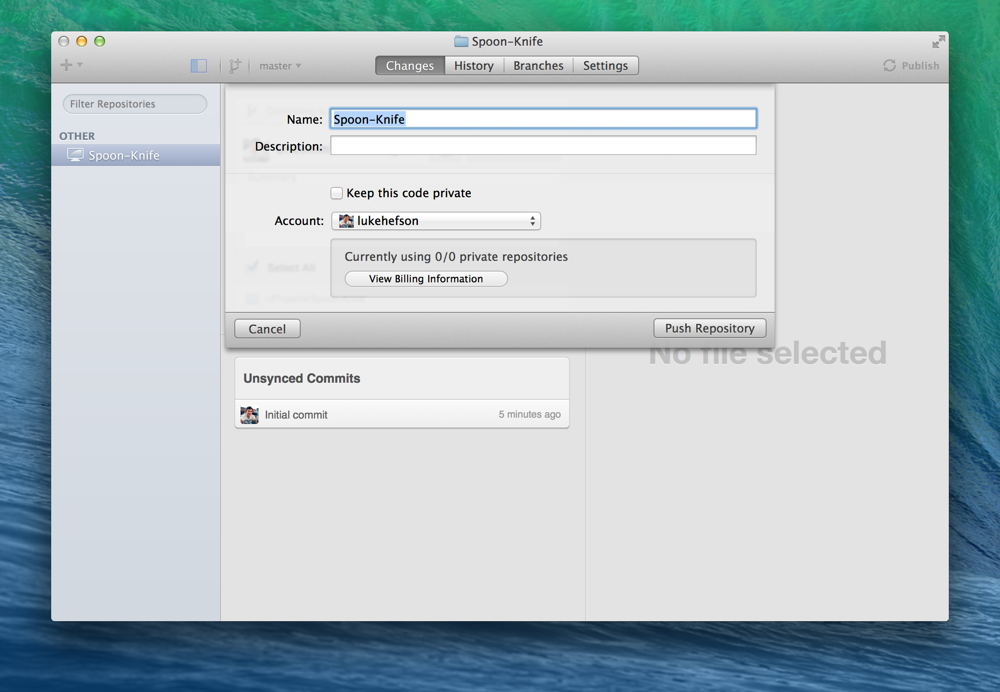

Software is at the heart of GitHub—and code is the DNA of software. Chances are if you're joining, you've got some code that you might want to push to GitHub. And that's a fantastic idea!

Here are some great reasons to push projects to GitHub:

* **Version Control** — Everything on GitHub is stored in <a href="http://git-scm.com" target="_blank">Git</a>, the best version control system around. Version control allows you to  experiment and make mistakes in code without messing up your final product.

* **Keep your code in one place** — Whether you work on multiple computers or just want to get some old projects off your computer, GitHub is the perfect place to store your projects online.

* **Collaboration** — Once your code is on GitHub, you can invite others to work on your code with you. Send them a link to help you debug a problem.

Once your project is on GitHub, we provide a URL for every file in your project. For example, this is Mike Bostock's popular <a href="https://github.com/mbostock/d3" target="_blank">d3</a> project for creating data-driven documents with JavaScript.

We use the words Git and GitHub a lot in this article, so let's clarify what they mean.

* **Git** — The version control tool that GitHub is built on top of.

* **GitHub** — Our company and the name of our software. We build software and websites to help you interact with Git repositories in a nice way.

* **GitHub.com** — The website you log into to view repositories online.

* **GitHub Desktop** — An application that you can install on your computer to help you synchronize local code with GitHub.com.

## GitHub Desktop

GitHub Desktop is the easiest way to get code on GitHub.com. You won't need to learn any command-line instructions, SSH keys, or complicated Git terminology. All you'll need is your Mac or Windows computer and a <a href="https://github.com/join" target="_blank">GitHub.com account</a>.

You can download GitHub Desktop for <strong><a href="http://mac.github.com" target="_blank">Mac</a></strong> and <strong><a href="http://windows.github.com" target="_blank">Windows</a></strong>. Once you install GitHub Desktop, a short set up wizard will walk you through some basic configuration and will help you connect GitHub Desktop with your GitHub.com account.

## Set up your project in GitHub Desktop

The easiest way to get your project into GitHub Desktop is to drag the folder with your code into the main application screen.

*Note: Our examples show the Mac app, but the flows are the same for the Windows app as well.*

If you are dragging in an existing Git repository, you can skip ahead and [push your code to GitHub.com](#pushit).

If the folder isn't a Git repository yet, GitHub Desktop will prompt you to turn it into a repository. Turning your project into a Git repository won't delete or ruin the files in your folder—it will simply create some hidden files that allow Git to do its magic.

### Your first commit

All Git repositories are based on *commits*—snapshots of your code at a point in time. You need to make at least one commit before you can push your code up to GitHub.com.

Navigate to the **Changes** tab and click **Commit** to create your first commit. You'll need to create a new commit every time you change files. Creating a commit is like saving a file—you are telling Git that you'd like to remember this point in history.

Make as many commits as you like locally. No one but you can see those commits until you push them to GitHub.com.

## Push your code to GitHub.com

Click the "Publish" button in the upper-right corner and GitHub Desktop will ask you what kind of repository to create:

* **Public repository**  — Anyone can see a public repository, but you choose who can commit (make changes) to it. You can create as many public repositories as you want on GitHub.com for free.

* **Private repository** — By default, only you can see a private repository. You choose who can see and commit to this repository by adding collaborators. Private repositories require a <a href="https://github.com/settings/billing" target="_blank">paid subscription</a> on GitHub.com.

Now that you've published the repository, you have it in two places:

* **Local repository on your computer** — You can work on this repository without an Internet connection using GitHub Desktop. This is where you edit files and make changes to your project.

* **Remote repository on GitHub.com** — You can send people links to your repository on GitHub.com so they can see your code and use all of GitHub's other features (like Issue management and Pull Requests).

Each time you make changes to your local repository, you'll need to sync your changes (by clicking the button in the upper-right corner of GitHub Desktop) to make sure they show up online.

## Getting code from GitHub.com

If you want to get some code from GitHub.com onto your computer or synchronize changes between multiple computers, you'll need to either pull changes or clone a repository:

* **Pull changes** — Click the "Sync" button in the upper-right corner of GitHub Desktop to bring code from an online repository (for example, changes that your co-worker pushed up) onto your computer. *Note: This will also push changes you haven't pushed yet.*

* **Clone a repository** — Click the "Clone in Desktop" button on GitHub.com to create a new copy of a repository on your computer.

## Celebrate!

Now you know the basics of setting up projects on GitHub!

* Download and use GitHub Desktop.
* Make commits every time you accomplish a goal or want to save your progress.
* Sync changes with GitHub.com to push your new commits and pull commits from others.

And you're done! Here's a bunch of <a href="https://github.com/features" target="_blank">awesome things you can do with repositories</a>.
