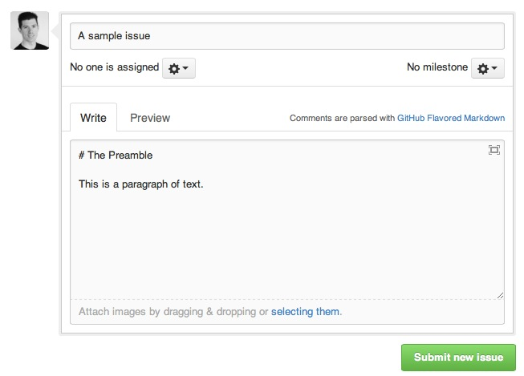
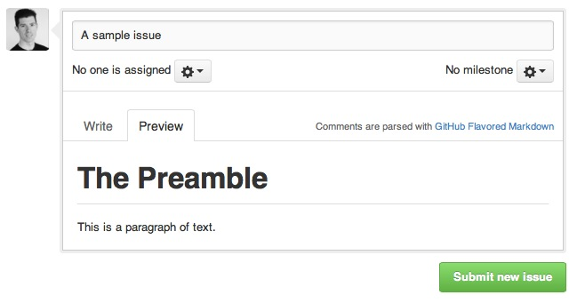

<a id="intro" title="Intro" class="toc-item"></a>
Markdown is a lightweight and easy-to-use syntax for styling all forms of writing on the GitHub platform.

**What you will learn:**

* How the Markdown format makes styled collaborative editing easy
* How Markdown differs from traditional formatting approaches
* How to use Markdown to format text
* How to leverage GitHub's automatic Markdown rendering
* How to apply GitHub's unique Markdown extensions

<a id="what" title="What is Markdown?" class="toc-item"></a>
## What is Markdown?

Markdown is a way to style text on the web. You control the display of the document; formatting words as bold or italic, adding images, and creating lists are just a few of the things we can do with Markdown. It was created by John Gruber as an easier way to write documents that contained more than just plain text.

<strong><a href="https://github.com/github/developer.github.com" target="_blank">Here's an example of Markdown from the GitHub API developer Documentation</a></strong>


Mostly, Markdown is just regular text with a few non-alphabetic characters thrown in, like `#` or `*`.

Imagine you have a document with several paragraphs. You think, "This would look better if I could include some formatting, like making a word italic, just like I would in a traditional word processor." A Markdown file would be perfect for this.

To try this out, [create a new practice issue](https://github.com/githubtraining/sample-markdown/issues/new) and type a bit of text in the comment section. Add a "#" symbol to the front of your sentence; this turns it into a header. You have now created the first heading of your document!



To see your craftsmanship, click on the "Preview" tab to see a rendered view of your Markdown.



You can also use Markdown in the following areas of GitHub.com:

- [Gists](https://gist.github.com/)
- Comments in Issues and Pull Requests
- Files with the `.md` or `.markdown` extension

<a id="syntax" title="Basic syntax" class="toc-item"></a>
## Basic syntax

Here's an overview of Markdown syntax that you can use anywhere on GitHub.com, or your own text files:

### Formatting text

#### Headers

```markdown
# This is an <h1> tag
## This is an <h2> tag
###### This is an <h6> tag
```

#### Text styles

```markdown
*This text will be italic*
_This will also be italic_
**This text will be bold**
__This will also be bold__

*You **can** combine them*
```

### Lists

#### Unordered

```markdown
* Item 1
* Item 2
  * Item 2a
  * Item 2b
```

#### Ordered

```markdown
1. Item 1
2. Item 2
3. Item 3
   * Item 3a
   * Item 3b
```

### Miscellaneous

#### Images

```markdown

Format: 
```

#### Links

```markdown
http://github.com - automatic!
[GitHub](http://github.com)
```

#### Blockquotes

```markdown
As Kanye West said:

> We're living the future so
> the present is our past.
```
<a id="GitHub-flavored-markdown" title="GFM" class="toc-item"></a>
## GitHub Flavored Markdown

GitHub.com has a useful set of additional Markdown syntax that differs from the format in files. These syntaxes correlate to information found on GitHub.com.

### Syntax highlighting

Here's an example of how you can use syntax highlighting with [GitHub Flavored Markdown](https://help.github.com/articles/github-flavored-markdown):

    ```javascript
    function fancyAlert(arg) {
      if(arg) {
        $.facebox({div:'#foo'})
      }
    }
    ```

You can also simply indent your code by four spaces:

        function fancyAlert(arg) {
          if(arg) {
            $.facebox({div:'#foo'})
          }
        }

Here's an example of Python code without syntax highlighting:

    def foo:
      if not bar:
        return true

### Inline code

    I think you should use an
    `<addr>` element here instead.

### Task Lists

```
- [x] @mentions, #refs, [links](), **formatting**, and <del>tags</del> supported
- [x] list syntax required (any unordered or ordered list supported)
- [x] this is a complete item
- [ ] this is an incomplete item
```

### SHA references

Any reference to a commit's [SHA-1 hash][] will be automatically converted into a link to that commit on GitHub.

  [SHA-1 hash]: http://en.wikipedia.org/wiki/SHA-1

```
16c999e8c71134401a78d4d46435517b2271d6ac
mojombo@16c999e8c71134401a78d4d46435517b2271d6ac
mojombo/github-flavored-markdown@16c999e8c71134401a78d4d46435517b2271d6ac
```

### Issue references within a repository

Any number that refers to an Issue or Pull Request will be automatically converted into a link.

```
#1
mojombo#1
mojombo/github-flavored-markdown#1
```

### Username @mentions

Typing an `@` symbol, followed by a username, will notify that person to come and view the comment. This is called an "@mention", because you're _mentioning_ the individual. You can also @mention teams within an organization.

### Automatic linking for URLs

Any URL (like `http://www.github.com/`) will be automatically converted into a clickable link.

### Strikethrough

Any word wrapped with two tildes (like `~~this~~`) will appear crossed out.

### Emoji

GitHub supports emoji! To see a list of every image we support, check out the [Emoji Cheat Sheet](http://www.emoji-cheat-sheet.com/).
