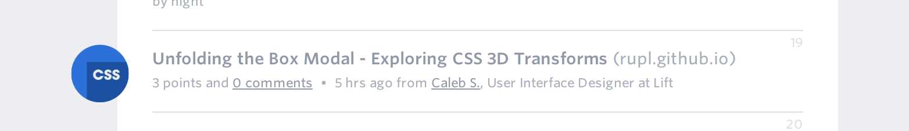
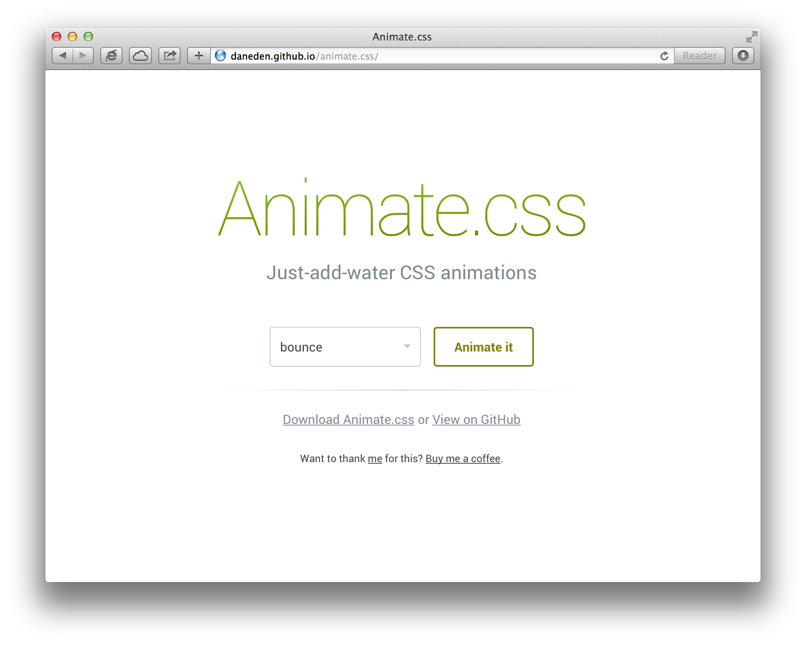

GitHub is home to more than 5 million open source projects. There are projects for every skill set like [recipes](https://github.com/sinker/tacofancy), [HTML/CSS](https://github.com/tobiasahlin/SpinKit), [Ruby](https://github.com/sferik/t), [Astrophysics](https://github.com/dfm/emcee) and many more. While every project and project maintainer(s) is different, this guide will introduce you to contributing standards that will help you get started almost anywhere.

## Find Projects

We recommend that you start by finding a project that you're already (or are interested in) using. Here are a few great places to look:

> Maybe say twitter and mention how much traffic comes in from Tiwtter

> How do we feel about these links/recommending outside places?

- [GitHub Explore](https://github.com/explore): Popular and trending projects.
- [GitHub Stars](https://github.com/stars?direction=desc&sort=created): Projects starred by other people.
- [Layervault News](http://news.layervault.com): Front-end and design projects.
- [CodeTriage](http://www.codetriage.com/): Projects with open issues (contributors needed).

## The Community

Open source projects are curated by people working in different roles:

- **Owner –** Person or organization responsible for creating the project.
- **Maintainer(s) –** People responsible for implementing changes and driving the project's direction. The owner and the maintainer can be the same people.
- **Core contributors –** People with write access to a repository who make regular contributions.
- **Contributors –** People who have had a pull request merged into a project.
- **Community Members –** People who use and care about the project and are active in bug tracking, feature discussions, and pull requests.

> What are 'community members' actually called?

## Reading the Docs

### Readme

Nearly all GitHub projects include a `README.md` file. The readme provides a lay of the land for a project with details on how to use, build and sometimes contribute to a project.

### Contributing.md

Projects and project maintainers vary, so the best way to contribute will also vary. Keep your eye open for a doc labeled "CONTRIBUTING." Contributing docs detail the specifics about how a project's maintainer would like to see patches or features contributed. This can include what tests to write, code syntax style or areas to focus on for patches.

### License.md

A license file, well, is the license for the project. An open source project's license informs users what they can and can't do (e.g., use, modify, redistribute), and contributors, what they are allowing others to do. There are many ways to license and open source project, you can read more about what each license means at [choosealicense.com](http://www.choosealicense.com).

### Contributor's License Agreement

Before you create a pull request with a patch or feature, you should know if that project requires contributors to sign a Contributor License Agreement (usually mentioned in the contributing documentation). This is a legally binding contract concerning the code that you're contributing. Most often the agreement's purpose is making binding the re-usability and responsibility of the code you're contributing.

> I'm probably explaining this terribly.

> Maybe we don't include CLAs in this guide?

### Documentation and Wikis

Many larger projects must beyond go the readme to give instructions for how people can use their project. In such cases you'll often find a link to another file or a folder named 'docs' in the repository. Alternatively, the repository may instead use the GitHub wiki to break down documentation.

_[Note: @jlord it would be great to link to a project with a docs folder and D3's wiki.]_

### GitHub Pages

GitHub offers [free static site hosting]() for all repositories (and users and organizations). Many open source projects take advantage of this by creating a website for the project -- a great resource for finding live demos. All pages hosted this way have a 'github.io' domain. Regardless of where the site is hosted, if a project has its own website, the link can often be found at the top of the repository's page on GitHub.

> Um, I wanted to use tobiasahlin/SpinKit as an example but turns out it's not making use of GitHub Pages!

_[Note to @jlord: We might want to capture this content Issues, PRs, etc. under a subhead similarly to how you captured the readme and other docs]_

## Create an Issue

If you find a bug in a project you're using (and you don't know how to fix it), have trouble following the documentation or have a question about the project -- create an issue! There's nothing to it and whatever issue you're having, you're likely not the only one, so others will find your issue helpful, too. We've got a guide on [issues]().

## Open a Pull Request

When you've found a feature to add or bug to fix in a project and you've read the documents on contributing, it's time to create a pull request. Be not afraid! Once you've submitted a pull request the maintainer(s) can compare your branch to the existing one and decide whether or not to incorporate (pull in) your changes.

After you've opened a pull request a discussion will start around your proposed changes. Other contributors and users may chime in, but ultimately the decision is made by the maintainer(s). You may be asked to make some changes to your pull request, if so, add more commits to your branch and push them -- they'll automatically go into the existing pull request.

If your pull request gets merged -- great! If it doesn't, no sweat, it may not be what the project maintainer had in mind, or they were already working on it. This happens, so our recommendation is to take any feedback you've receive and go forth and pull request again -- or [create your own open source project](theotherguide).

> find better image

### Pull Request Pro Tips :TM:

- [Fork](http://guides.github.com/overviews/forking/) the repository and clone it locally. Connect your local to the original 'upstream' repository by adding it as a remote. **Pull in changes** from 'upstream' often so that you stay up to date so that when you submit your pull request, merge conflicts will be less likely. See more detailed instructions [here](https://help.github.com/articles/syncing-a-fork).
- Create a [**branch**](http://guides.github.com/overviews/flow/) for your edits.
- In the body of your pull request, **be clear** about what problem was occurring and how someone can recreate that problem. Then be equally as clear about what steps you took to make your changes.
- It's best to **test**. Run your changes against any existing tests if they exist and create new ones when needed. Whether tests exist or not, make sure your changes don't break the existing project.
- If your changes include differences in HTML/CSS, **include screenshots** of the before and after. Just drag and drop the images into the body of your pull request.
- If the project you're contributing to doesn't have guidelines on contributing, it's always best to create your contribution in the **style of the project**. This may mean using indents, semi colons or comments differently than you would in your own repository, but makes it easier for the maintainer to merge.
