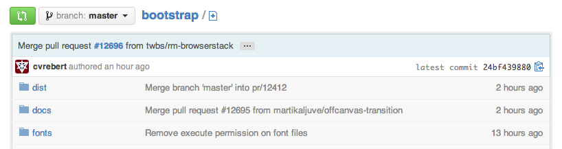

<a id="intro" title="Intro" class="toc-item"></a>

A great way to get involved in open source is to contribute to the existing projects you're using. GitHub is home to more than 5 million open source projects. There are projects for every skill set like [recipes](https://github.com/sinker/tacofancy), [HTML/CSS](https://github.com/tobiasahlin/SpinKit), [Ruby](https://github.com/sferik/t), [Astrophysics](https://github.com/dfm/emcee) and many more. This guide will cover what you might find in a typical project and how to make a great contribution.

<a id="find" title="Find Projects" class="toc-item"></a>

### Find Projects

Get started by finding a project that you're also interested in using. You'll find GitHub projects being shared all over the internet. A few great places to keep an eye on are:

> Maybe say twitter and mention how much traffic comes in from Tiwtter

> How do we feel about these links/recommending outside places?

- [GitHub Explore](https://github.com/explore): A page highlighting popular projects by language, popularity throughout GitHub or within your organization or those you follow.
- [GitHub Stars](https://github.com/stars?direction=desc&sort=created): Checking out the repositories another user stars is a great way to find interesting projects. Be [social](http://guides.github.com/overviews/socialize/).
- [Layervault News](http://news.layervault.com): Many front-end and design projects are shared here.
- [CodeTriage](http://www.codetriage.com/): A directory of projects with open issues.


<a id="readme" title="Readme and other Docs" class="toc-item"></a>

<a id="community" title="The Community" class="toc-item"></a>

## A Typical Project

Below are some elements you're likely to come across in an open source project on GitHub.

### The Community

Projects often have a community around them, made up of other users in different (formal or informal) roles:

- **Owner** is the user or organization that created the project has the project on their account.
- **Maintainers and Core Contributors** are the users primarily doing the work on a project and driving the direction. Oftentimes the owner and the maintainer are the same. They have write access to the repository.
- **Contributors** is everyone who has had a pull request merged into a project.
- **Community Members** are the users who often use and care deeply about the project and are active in discussions for features and pull requests.

> What are 'community members' actually called? Does core-contributors need to be it's own, do some core-contributors not have access and contribute via PRs?

<a id="pr" title="Pull Request" class="toc-item"></a>

### Reading the Docs

The what's-what of common files in projects.

#### Readme

Nearly all GitHub projects include a `README.md` file. The readme provides a lay of the land for a project with details on how to use, build and sometimes contribute to a project.

#### Contributing.md

Projects and project maintainers vary, so the best way to contribute will also vary. Keep an eye out for a doc labeled "CONTRIBUTING." Contributing docs detail the specifics about how a project's maintainer would like to see patches or features contributed. This can include what tests to write, code syntax style or areas to focus on for patches.

#### License.md

A license file is straightforward -- it provides the license for the project. There are many ways _to be_ open source and for each of those ways there is a license. Read more about what each license means at [choosealicense.com](http://www.choosealicense.com).

> Emphasis probably not needed

#### Documentation and Wikis

Many larger projects must beyond go the readme to give instructions for how people can use their project. In such cases you'll often find a link to another file or a folder named 'docs' in the repository.



Alternatively, the repository may instead use the GitHub wiki to break down documentation.


#### GitHub Pages

GitHub offers [free static site hosting](http://pages.github.com) for all repositories (and users and organizations). Many open source projects take advantage of this by creating a website for the project -- a great resource for finding live demos. All pages hosted this way have a 'github.io' domain. Regardless of where the site is hosted, if a project has its own website, the link can often be found at the top of the repository's page on GitHub.


<a id="issue" title="Create an Issue" class="toc-item"></a>


## Contributing

Now that you've found the material for understanding the project, here is how you can take action.

### Create an Issue

If you find a bug in a project you're using (and you don't know how to fix it), have trouble following the documentation or have a question about the project -- create an issue! There's nothing to it and whatever issue you're having, you're likely not the only one, so others will find your issue helpful, too. For more information on how issues work, check out our [Issues guide](http://guides.github.com/overviews/issues).

> Why don't my :tm:s work?

#### Issues Pro Tips :TM:

- **Check existing issues** for your issue. Duplicating an issue is slower for both parties so search through open and closed issues to see if what you're running into has been addressed already.
- **Be clear** about what your problem is. Detail how someone else can recreate the problem.
- **Include system details** like what the browser, library or operating system you're using and its version.
- **Paste error output** or logs in your issue or in a [Gist](http://gist.github.com). If pasting them in the issue, wrap it in three backticks: ` ``` ` so that it renders nicely.
- **Link to demos** recreating the problem on things like [JSFiddle](http://jsfiddle.net) or [CodePen](http://codepen.io).

<a id="pr" title="Pull Request" class="toc-item"></a>

### Pull Request

If you're able to patch the bug or add the feature yourself -- fantastic, make a pull request with the code! Be sure you've read any documents on contributing, understand the license and have signed a CLA if required. Once you've submitted a pull request the maintainer(s) can compare your branch to the existing one and decide whether or not to incorporate (pull in) your changes.

#### Pull Request Pro Tips :TM:

- [Fork](http://guides.github.com/overviews/forking/) the repository and clone it locally. Connect your local to the original 'upstream' repository by adding it as a remote. **Pull in changes** from 'upstream' often so that you stay up to date so that when you submit your pull request, merge conflicts will be less likely.
- Create a [**branch**](http://guides.github.com/overviews/flow/) for your edits.
- In the body of your pull request, **be clear** about what problem was occurring and how someone can recreate that problem. Then be equally as clear about what steps you took to make your changes.
- It's best to **test**. Run your changes against any existing tests if they exist and create new ones when needed. Whether tests exist or not, make sure your changes don't break the existing project.
- If your changes include differences in HTML/CSS, **include screenshots** of the before and after. Just drag and drop the images into the body of your pull request.
- If the project you're contributing to doesn't have guidelines on contributing, it's always best to create your contribution in the **style of the project**. This may mean using indents, semi colons or comments differently than you would in your own repository, but makes it easier for the maintainer to merge.

#### Open Pull Requests

Once you've opened a pull request a discussion will start around your proposed changes. Other contributors and users may chime in, but ultimately the decision is made by the maintainer(s). You may be asked to make some changes to your pull request, if so, add more commits to your branch and push them -- they'll automatically go into the existing pull request.


If your pull request is merged -- great! If it is not, no sweat, it may not be what the project maintainer had in mind, or they were already working on it. This happens, so our recommendation is to take any feedback you've received and go forth and pull request again -- or [create your own open source project](theotherguide).

> find better image
