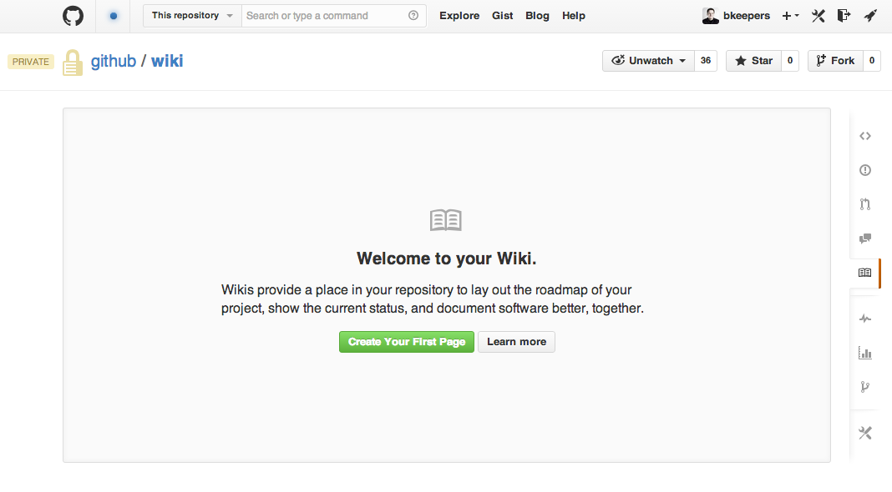
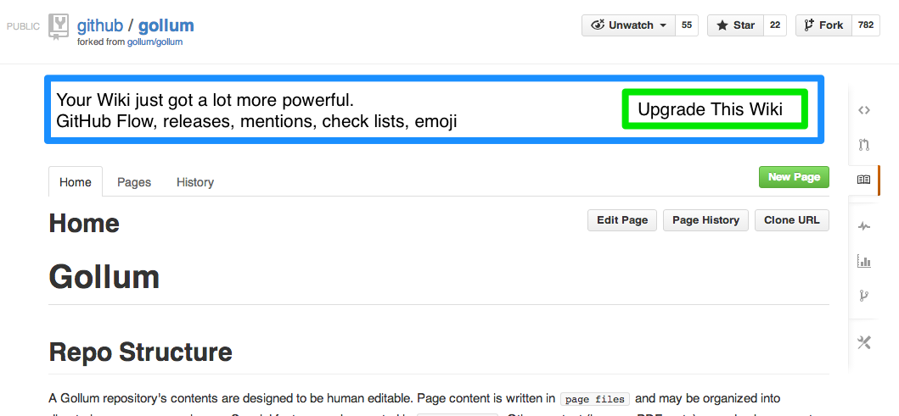

Good documentation is key to the success of any project. Making that documentation accessible enables people to learn about your project. Making it easy to update ensures that it stays relevant. **Wikis** on GitHub are a great way to present information about a project in a readable way while making it easy for contributors to propose changes.

## Creating Your Wiki

Every repository on GitHub has a wiki. Starting your wiki is simply a matter of creating the first page.



## Adding a Page

Wiki content is designed to be human editable. By default, all your wiki content is stored in the `docs` directory of your repository,  which can be changed in your repository settings.

Wiki pages can be organized into directories any way you choose. Other content—like images or PDFs—can also be present and organized in the same way. Wiki pages can be written in any format supported by [GitHub Markup](http://github.com/github/markup). GitHub detects the page file format via the extension, so files must have one of the default or registered extensions in order to be converted.

The special page file `Home.ext` (where the extension is one of the supported
formats) will be used as the entrance page to your wiki. If it is missing, an
automatically generated table of contents will be shown instead.

## The GitHub Workflow

Wiki content is versioned just like everything else in a repository. Contributors can use  the [GitHub Workflow](http://guides.github.com/overviews/flow/) to make pull requests to the wiki in the same way as any other files in the repository. Use branches and tags to keep track of different versions of content to go along with releases of a project.


## Sidebar

By default, the sidebar will list all of the pages in your wiki. When you add new pages, they will be added to the sidebar.

If you would like to manage it yourself, click the "Edit" link in the sidebar and include whatever custom content that you would like to display on each page.

The sidebar content will be saved in a file named `_Sidebar` and, like wiki pages, can use any of format supported by [GitHub Markup](http://github.com/github/markup). Sidebars affect all pages in their directory and any subdirectories that do not have a sidebar file of their own.


## Syntax Highlighting

Wiki pages support  automatic syntax highlighting of code for a wide range of
languages by using the following syntax:

    ```ruby
      def foo
        puts 'bar'
      end
    ```

The block must start with three backticks, optionally followed by the the name of the language that is contained by the block. See [Pygments for the list of languages](http://pygments.org/docs/lexers/) that can be syntax highlighted.

The block contents should be indented at the same level than the opening backticks. The block must end with three backticks indented at the same level than the opening backticks.

## Upgrading Your Wiki

Wikis used to be stored in a separate repository from the main project. If your project has been around for a while, it might need to be upgraded. Click the "Upgrade This Wiki" button to merge your exisitng wiki content into your project's repository and to take advantage of all the latest features of Wikis.


